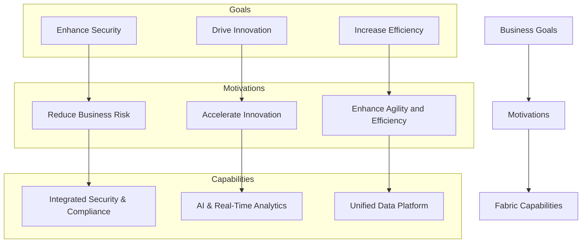

# Determine your motivations for adopting Microsoft Fabric

Understanding your motivations for adopting Microsoft Fabric is essential to align business and IT strategies, justify investments, and prioritize adoption efforts effectively.

Clearly defined motivations help you realize value, reduce risks, and ensure sustainable governance in your Fabric environment.



## Why define your motivations?

Clarifying your motivations for adopting Microsoft Fabric enables you to:

- Align business, IT, and data governance strategies seamlessly
- Prioritize domains, data products, and workloads effectively
- Make informed decisions on licensing, training, and operations
- Maximize return on investment and leverage platform capabilities

Microsoft Fabric delivers value both directly—through cost savings and simplified governance—and indirectly—by accelerating insights and fostering collaboration across domains.

## Example motivations for Fabric adoption

### Reduce business risk

- **Security**: Utilize Microsoft Entra ID, Purview, RLS/OLS, and encryption to safeguard your data.
- **Compliance management**: Implement DLP policies, audit trails, and sensitivity labeling to minimize exposure.
- **Business continuity**: Benefit from cloud-based recovery, replication, and OneLake's global availability.
- **Data governance**: Maintain consistent metadata management and lineage tracking with Purview.
- **Infrastructure modernization**: Replace fragmented tools with a unified Fabric platform.

### Accelerate innovation

- **AI & Copilot integration**: Empower intelligent data interaction with built-in Copilot and machine learning services.
- **Real-time data insights**: Leverage Eventhouse and Real-Time Intelligence for dynamic decision-making.
- **Composable architecture**: Use modular services like Lakehouse and semantic models for agile development.
- **Data democratization**: Enable domain teams with governed self-service and semantic layers in Power BI.
- **Innovation velocity**: Rapidly launch prototypes and analytics use cases without full infrastructure deployment.

### Enhance agility and efficiency

- **Operational efficiency**: Standardize tools, workspaces, and pipelines across domains.
- **Multi-domain support**: Facilitate Data Mesh and cross-functional collaboration via OneLake sharing.
- **Simplified platform**: Consolidate data movement, transformation, storage, and reporting into one platform.
- **Scalability**: Dynamically scale workloads such as Lakehouse compute and Power BI Premium capacity.
- **Workspace management**: Govern resource allocation, lifecycle, and usage per domain.

## Classify and prioritize motivations

After identifying your key motivations, evaluate each based on its business relevance and urgency to focus your efforts where they matter most.

| Motivation category            | Consideration                     | Priority | Urgency |
|-------------------------------|---------------------------------|----------|---------|
| Reduce business risk           | Data governance via Purview     | High     | High    |
| Reduce business risk           | Centralized access control      | High     | High    |
| Accelerate innovation          | AI & Copilot enablement         | High     | Medium  |
| Accelerate innovation          | Real-time analytics (Eventhouse)| Medium   | Medium  |
| Enhance agility and efficiency | Workspace standardization       | High     | Medium  |
| Enhance agility and efficiency | Cross-domain collaboration      | Medium   | Low     |

```mermaid
graph LR
    style UR fill:#f96,stroke:#333,stroke-width:2px
    style UL fill:#9f6,stroke:#333,stroke-width:2px
    style LR fill:#69c,stroke:#333,stroke-width:2px
    style LL fill:#ccc,stroke:#333,stroke-width:2px

    subgraph Business Relevance
        direction TB
        UL[High Relevance]
        LL[Low Relevance]
    end

    subgraph Urgency
        direction LR
        UR[High Urgency]
        LR[Low Urgency]
    end

    UL --- UR
    LL --- LR
    UL --- LL
    UR --- LR

    UR -->|Reduce business risk: Data governance via Purview| A1
    UR -->|Reduce business risk: Centralized access control| A2
    UL -->|Accelerate innovation: AI & Copilot enablement| B1
    UL -->|Enhance agility: Workspace standardization| C1
    LR -->|Enhance agility: Cross-domain collaboration| D1
    UL -->|Accelerate innovation: Real-time analytics (Eventhouse)| B2
```

Regularly revisit and update your motivations as your business goals evolve. Linking each strategic or technical goal to a clear motivation ensures focused and successful adoption of Microsoft Fabric.
