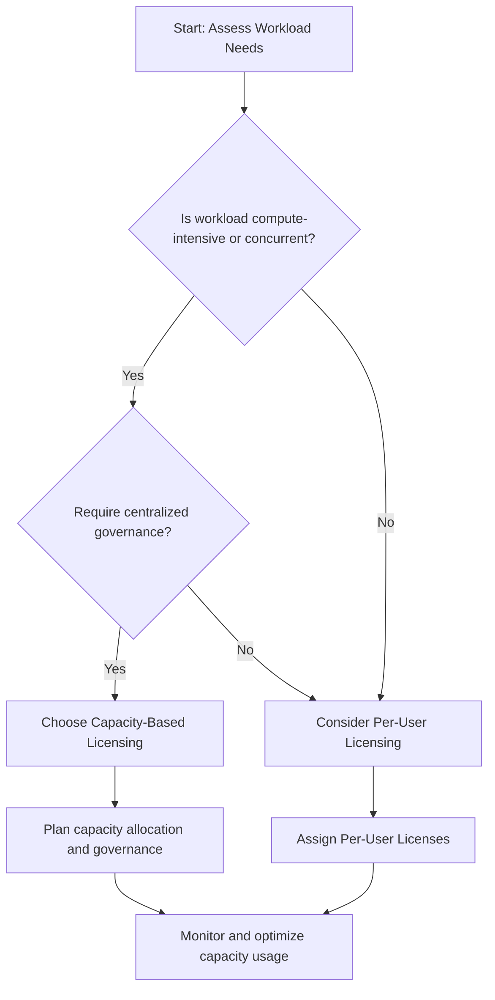
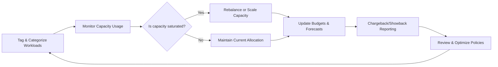

# Cost Efficiency in Microsoft Fabric Adoption

Achieving cost efficiency in Microsoft Fabric adoption requires a strategic and transparent approach to managing capacity-based licensing, per-user licensing, and operational consumption. Fabric’s unique pricing and resource models demand careful planning to maximize business value, minimize waste, and support scalable, data-driven innovation.

## Understanding the Fabric Cost Model: Capacity vs. Per-User Licensing

Microsoft Fabric introduces a hybrid licensing model that differs significantly from traditional CapEx-to-OpEx cloud transitions:

- **Capacity-Based Licensing**: Organizations purchase capacity units (CUs) that are shared across services like Power BI, Lakehouse, Warehouse, and Data Activator. These pooled resources are ideal for dynamically scaling workloads but require careful governance to avoid resource contention.
- **Per-User Licensing**: Power BI Pro and Premium Per User (PPU) licenses apply to individual content creators or analysts, providing flexibility for specific roles with predictable costs.

When deciding between capacity-based and per-user licensing, consider the following factors:

- The intensity and concurrency of compute workloads
- The balance between self-service capabilities and centralized governance
- The degree of resource sharing across domains or business units
- Budget predictability and workload isolation needs

Fabric operates under a Software-as-a-Service (SaaS) cost model, where capacity units (CUs) are billed as a bundled service rather than as isolated infrastructure components. This means you don’t manage individual compute nodes or clusters; instead, you pay for an abstracted, managed compute experience. However, while many services are included within capacity, some services and resources incur separate charges.

### Licensing Decision Flowchart



### Additional Cost Drivers

Besides licensing, organizations must also plan for:

- **OneLake Storage Costs**: Storage consumption in OneLake is billed separately from compute. Large-scale data ingestion, long-term retention, and data duplication across domains can increase storage costs significantly.
- **Real-Time Intelligence Charges**: Services like Eventstream and Real-Time Analytics are not fully covered by Fabric Capacity. These incur separate consumption-based costs depending on usage volume and data throughput. Proper sizing and routing strategies are essential to maintain predictable real-time costs.

While capacity-based licensing facilitates scalability and performance, it can introduce challenges such as **noisy neighbor effects**, where one team’s heavy workload impacts others sharing the same capacity. Proactive capacity planning and workload segmentation help mitigate these risks.

## Applying FinOps to Microsoft Fabric

To achieve long-term cost efficiency and accountability, organizations should adopt the **FinOps framework**—a cloud financial management discipline that aligns engineering, finance, and business teams.

In the context of Microsoft Fabric, FinOps involves:

- **Workspace-Level Visibility**: Tagging and categorizing workloads by business domain, owner, or use case to enhance transparency and reporting.
- **Cross-Capacity Optimization**: Monitoring and rebalancing workloads across multiple capacities to maintain performance and avoid saturation.
- **Chargeback and Showback Models**: Allocating costs back to domains or teams using usage-based reporting, fostering ownership and budget discipline.
- **Segmentation and Isolation**: Distributing workloads across DEV, TEST, and PROD capacities to prevent bottlenecks and enable precise cost modeling.

### FinOps Process Flow



## Chargeback and Hosting Cost Allocation

To allocate hosting costs effectively across departments or workloads, organizations can use Fabric Metrics and Chargeback apps. These tools provide detailed insights into capacity unit (CU) consumption, enabling transparent cost distribution based on actual usage.

Microsoft guidance indicates that CU consumption is measured in CU-seconds—calculated as the number of CUs consumed per second multiplied by 86,400 seconds per day. This granular metric allows precise tracking of resource utilization over time. Cost allocation models should also account for unused CUs; governance policies need to clearly define how costs related to idle capacity are distributed among teams or departments.

Beyond capacity charges, additional costs include storage and network egress, which must be tracked separately. Tools like the Fabric Unified Allocation Model (FUAM) assist in estimating cost breakdowns by comparing CU consumption data against published capacity price tables, facilitating accurate cost attribution.

Implementing these cost allocation models requires understanding capacity usage patterns and organizational policies to ensure fairness and promote accountability across business units.

### Cost Allocation Diagram

```mermaid
flowchart TD
    A[Total Capacity Units (CUs)] --> B{Consumed vs. Idle?}
    B -- Consumed --> C[Measure CU-Seconds per Team]
    B -- Idle --> D[Allocate Idle Costs per Policy]
    C --> E[Calculate Cost per Team]
    D --> E
    E --> F[Generate Chargeback Reports]
    F --> G[Distribute Costs to Departments]
```

## Strategic Recommendations

### Optimize Capacity and Licensing

- Combine per-user and capacity-based licensing strategically to balance flexibility and control.
- Assign dedicated capacities for critical or high-throughput workloads.
- Enable autoscaling and real-time monitoring to adjust to demand peaks and avoid cost overruns.
- Regularly review capacity utilization and reallocate resources as needed.

### Implement FinOps Governance

- Use Microsoft Cost Management and Azure tagging to establish clear cost attribution.
- Integrate CU usage tracking and budget controls into your workspace governance model.
- Establish policies for resource rightsizing, cost anomaly detection, and usage thresholds.
- Align cost reporting cycles with planning and roadmap reviews.

### Build a Culture of Financial Accountability

- Educate product teams, architects, and analysts on the implications of Fabric licensing and capacity sharing.
- Integrate financial metrics into OKRs and KPIs for data product teams.
- Foster cross-functional collaboration between IT, Finance, and business units through regular cost review forums.

## Additional Considerations

- Use multiple capacities to avoid contention between teams and domains.
- Review licensing changes and feature usage regularly to prevent over- or under-licensing.
- Apply predictive analytics to forecast usage and model future needs based on domain growth or project pipelines.

## Learn More

- [Microsoft Fabric licensing overview](https://learn.microsoft.com/en-us/fabric/enterprise/licenses?wt.mc_id=AZ-MVP-5003447)
- [FinOps Foundation](https://www.finops.org/)
- [Fabric capacity metrics app](https://learn.microsoft.com/en-us/fabric/enterprise/metrics-app-install?tabs=1st?wt.mc_id=AZ-MVP-5003447)
