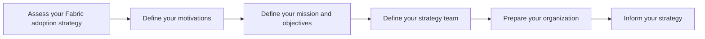

## What is a Fabric adoption strategy?

A Fabric adoption strategy is a comprehensive plan that outlines your organization's approach to integrating Microsoft Fabric into its data and analytics landscape. The goal is to align technology investments with business outcomes, ensure stakeholder alignment, and create a roadmap for value realization and governance.

Like cloud adoption, successful Fabric adoption typically matures in iterations. This strategy methodology can be used as a living framework—revisited regularly to reassess goals, adjust plans, and ensure continuous improvement.

Developing a Fabric adoption strategy helps you:

- Realize value: Optimize your Microsoft Fabric investment for agility, productivity, and ROI.
- Ensure business-driven decisions: Align Fabric initiatives with business goals and key performance indicators.
- Drive cross-functional alignment: Foster collaboration among IT, data, governance, and business teams.
- Mitigate risks: Reduce the complexity of migrating and integrating legacy workloads into Fabric.
- Continuously improve: Establish a strategy that evolves with business priorities, costs, architecture, and security needs.

### Strategy building steps

The Microsoft Cloud Adoption Framework outlines five key steps that also apply to a Microsoft Fabric adoption strategy:

| Step                                  | Purpose                                                                                       |
|---------------------------------------|-----------------------------------------------------------------------------------------------|
| Assess your Fabric adoption strategy  | Understand current capabilities, maturity, and gaps across people, processes, and platforms.  |
| Define your motivations               | Clarify why your organization is adopting Microsoft Fabric.                                   |
| Define your mission and objectives    | Set a clear strategic intent and measurable goals that reflect your motivations.              |
| Define your strategy team             | Identify roles and responsibilities for executing and governing the Fabric adoption strategy. |
| Prepare your organization             | Align leadership, prepare the operating model, and enable organizational readiness.           |
| Inform your strategy                  | Use insights from previous steps to shape and refine your Fabric adoption approach.           |

1. [Assess your adoption readiness](assess-your-fabric-adoption-strategy.md)  
   Understand current capabilities, maturity, and gaps across people, processes, and platforms.

2. [Define your motivations](determine-your-motivations.md)  
   Clarify why your organization is adopting Microsoft Fabric (e.g., real-time analytics, consolidation, self-service BI).

3. [Define your mission and objectives](define-your-mission-and-objectives.md)  
   Set a clear strategic intent and measurable goals that reflect your motivations.

4. [Define your strategy team](define-your-strategy-team.md)  
   Identify roles and responsibilities for executing and governing the Fabric adoption strategy.

5. [Prepare your organization](prepare-your-organization.md) 
   Align leadership, prepare the operating model, and move from project- to product-centric data thinking.

Additional focus areas include:

- [Cost efficiency and financial planning](cost-efficiency.md)
- [Data security and governance](security.md)
- [AI enablement](ai-enablement.md)
- [Resilient architecture planning](resiliency.md)
- [Sustainability and operational responsibility](sustainability.md)

For large enterprises and startups alike, these steps help establish a scalable, adaptive approach to successful Microsoft Fabric adoption.

## Define business outcomes

Start your Fabric adoption by clearly identifying what business outcomes you're trying to achieve. These may include:

- Accelerating decision-making with real-time analytics
- Enabling self-service BI across departments
- Reducing reliance on legacy data warehouse infrastructure
- Improving data governance and compliance posture
- Supporting AI and machine learning initiatives

These outcomes provide the foundation for scoping, prioritizing, and justifying your adoption of Microsoft Fabric.

## Understand motivations

Understanding why your organization is moving toward Microsoft Fabric helps align business and technical stakeholders. Common motivations include:

- Cost savings through unified data platform
- Enhanced agility via integrated services (e.g., Power BI, Dataverse, Data Factory)
- Increased data security and compliance via Microsoft Purview
- Faster time-to-insight across business domains

Capture these motivations early and communicate them broadly.

## Identify business justification

To build internal alignment and secure stakeholder support, define a compelling justification. This may be supported by:

- Total cost of ownership (TCO) comparisons
- Use case mapping and value stream identification
- Expected ROI from data products and self-service analytics
- Alignment with existing Microsoft investments (e.g., Entra ID, Microsoft 365, Power Platform, Dynamics)

## Prioritize projects

Break down your Fabric adoption into manageable initiatives. Examples:

- Phase 1: Power BI consolidation into centralized workspaces
- Phase 2: Migration of existing lakehouses or data warehouse workloads
- Phase 3: Real-time integration for key operational systems
- Phase 4: Implementation of data governance and Purview classification
- Phase 5: Domain enablement for Data Mesh

Each phase should have a defined owner, timeline, and success metric.

## Define success criteria

Set measurable outcomes for Fabric adoption success. These might include:

- Reduced report delivery time by 50%
- 80% of business units using governed workspaces
- Full lineage and classification coverage for sensitive data
- 100% compliance with audit and access policies
- 3–5 operational data products deployed per domain

## Align stakeholders and sponsors

Engage the right mix of business, IT, data, and security stakeholders. Recommended roles:

- Executive sponsor
- Data platform lead
- Domain and data product owners
- Governance & compliance officer
- Adoption/change manager

Use this group to review strategy progress and resolve blockers across business and IT.

## Resources

- [CAF Strategy for Azure](https://learn.microsoft.com/en-us/azure/cloud-adoption-framework/strategy/?wt.mc_id=AZ-MVP-5003447)
- [Microsoft Fabric overview](https://learn.microsoft.com/en-us/fabric/?wt.mc_id=AZ-MVP-5003447)
