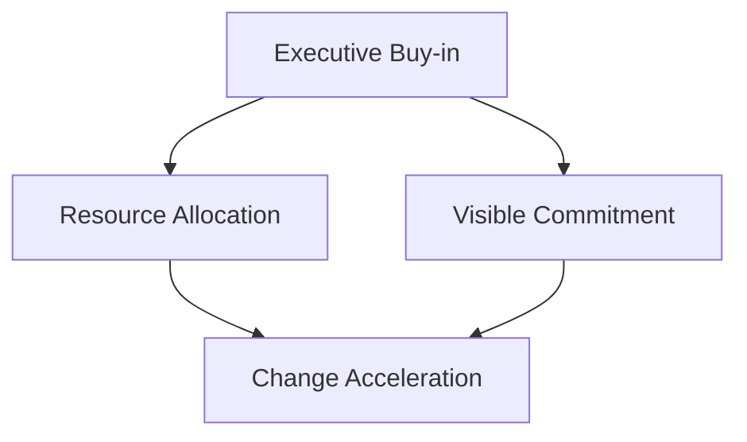
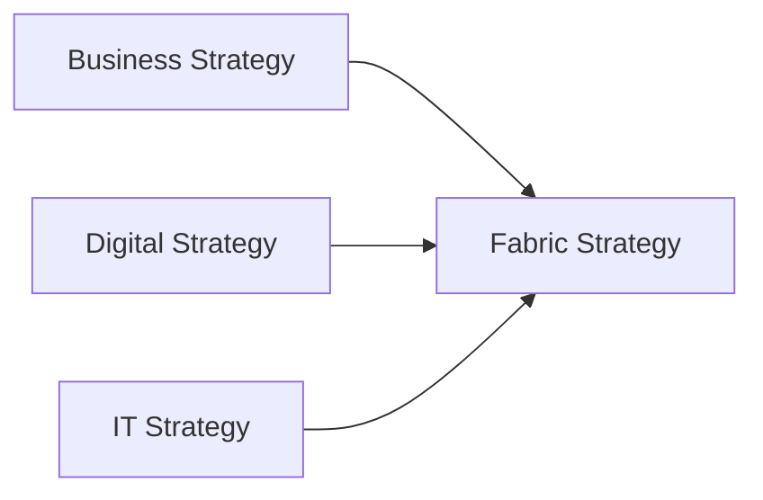

# Prepare your organization for Microsoft Fabric adoption

Organizational alignment is critical to executing a successful Microsoft Fabric adoption strategy. Aligning leadership, existing strategies, the operating model, and the delivery model ensures buy-in, focus, and resource allocation across business and IT.

## Leadership and executive buy-in

A Fabric strategy based on your organization’s motivations and objectives requires strong support from leadership. Without executive buy-in, adoption efforts are at risk of delays, resource shortages, and misalignment.

**Recommendations:**

- **Align leadership with strategic goals:** Communicate the long-term value and risks of Fabric adoption. Help leaders understand the connection to business outcomes.
- **Secure resources:** Ensure leaders are willing to fund time, tools, and talent needed for Fabric implementation.
- **Communicate commitment:** Make leadership support visible to reduce resistance and accelerate change management across the organization.

## Align organizational strategies

Microsoft Fabric often intersects with multiple organizational strategies:

- **Business strategy:** Drives outcomes like growth, customer satisfaction, and efficiency.
- **Digital strategy:** Focuses on transformation, new services, and data innovation.
- **IT strategy:** Covers infrastructure, modernization, security, and compliance.

**Recommendations:**

- Regularly review alignment between your Fabric strategy and business/digital/IT strategies.
- Use agile feedback loops to adjust to shifting priorities.
- Involve business leaders early in planning to secure shared goals and ownership.

## Understand your operating model's readiness

Fabric adoption requires the right people, processes, technologies, and partners. Traditional organizational models may need to evolve.

**Key aspects to assess:**

- **Capabilities and processes:** Assess security, DevOps, analytics, and governance maturity.
- **Culture:** Identify resistance to change or risk-averse mindsets that could slow adoption.
- **Roles and skills:** Determine gaps in Fabric-specific expertise (e.g., Spark, OneLake, DAX, Entra ID).

**Recommendations:**

- Run an operating model workshop to benchmark your current state.
- Identify gaps that must be addressed to enable Fabric successfully.
- Inform and involve stakeholders in readiness assessments and mitigation planning.
- Conduct readiness surveys across departments to assess preparedness.
- Create a maturity heatmap to visualize strengths and weaknesses across organizational units.

## Shift from project to product mindset

Fabric supports a product-oriented model where data products are continuously improved, owned by cross-functional teams, and aligned to business outcomes.

**Differences:**

| Project Model | Product Model |
|---------------|----------------|
| Task-based, fixed scope | Outcome-based, evolving value |
| Temporary ownership | Persistent, end-to-end ownership |
| Budget-focused (CAPEX) | Value-focused (OPEX/continuous) |

**Benefits:**

- Accelerates innovation and adoption of self-service models.
- Drives continuous delivery of business value.
- Enables governance by design via reusable policies and templates.
- Increases stakeholder engagement by involving business and IT throughout the lifecycle.
- Improves measurement of business value delivery through ongoing feedback and metrics.

**Recommendations:**

- Evaluate your current delivery model and team structures.
- Define a Fabric product model with domain-aligned teams and value streams.
- Set expectations for new operating rhythms and cultural shifts.

## Identify and define partner relationships

Fabric adoption often requires external expertise and collaboration.

**Recommendations:**

- **Identify strategic partners:** Include Microsoft, ISVs, and integrators that support data, identity, and application platforms.
- **Promote integrated partnerships:** Treat vendors as strategic allies, not just suppliers.
- **Meet regularly:** Include partners in governance, KPI reviews, and planning sessions.
- Create joint roadmaps with partners to ensure alignment of goals and timelines.
- Set up shared innovation initiatives to co-develop solutions and accelerate value realization.

---

Preparing your organization is foundational to scaling Fabric successfully. Strategic alignment, executive support, delivery models, and clear ownership enable sustainable adoption.
